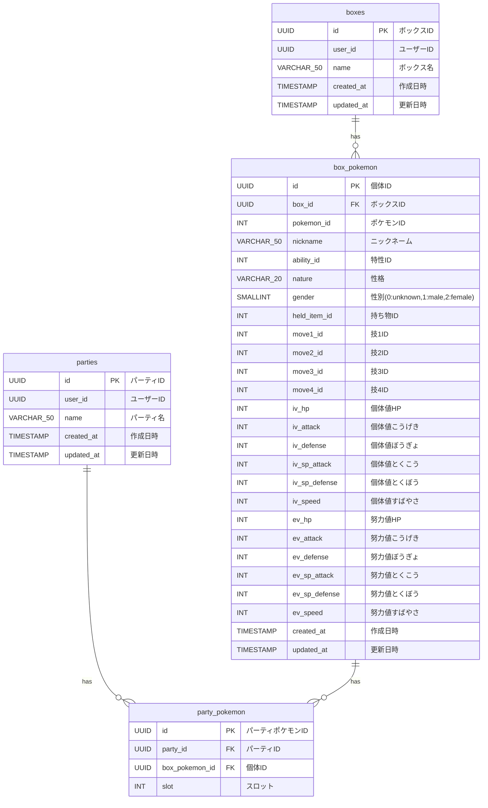

```mermaid
erDiagram
    boxes {
        UUID id PK "ボックスID"
        UUID user_id "ユーザーID"
        VARCHAR_50 name "ボックス名"
        TIMESTAMP created_at "作成日時"
        TIMESTAMP updated_at "更新日時"
    }

    box_pokemon {
        UUID id PK "個体ID"
        UUID box_id FK "ボックスID"
        INT pokemon_id "ポケモンID"
        VARCHAR_50 nickname "ニックネーム"
        INT ability_id "特性ID"
        VARCHAR_20 nature "性格"
        SMALLINT gender "性別(0:unknown,1:male,2:female)"
        INT held_item_id "持ち物ID"
        INT move1_id "技1ID"
        INT move2_id "技2ID"
        INT move3_id "技3ID"
        INT move4_id "技4ID"
        INT iv_hp "個体値HP"
        INT iv_attack "個体値こうげき"
        INT iv_defense "個体値ぼうぎょ"
        INT iv_sp_attack "個体値とくこう"
        INT iv_sp_defense "個体値とくぼう"
        INT iv_speed "個体値すばやさ"
        INT ev_hp "努力値HP"
        INT ev_attack "努力値こうげき"
        INT ev_defense "努力値ぼうぎょ"
        INT ev_sp_attack "努力値とくこう"
        INT ev_sp_defense "努力値とくぼう"
        INT ev_speed "努力値すばやさ"
        TIMESTAMP created_at "作成日時"
        TIMESTAMP updated_at "更新日時"
    }

    parties {
        UUID id PK "パーティID"
        UUID user_id "ユーザーID"
        VARCHAR_50 name "パーティ名"
        TIMESTAMP created_at "作成日時"
        TIMESTAMP updated_at "更新日時"
    }

    party_pokemon {
        UUID id PK "パーティポケモンID"
        UUID party_id FK "パーティID"
        UUID box_pokemon_id FK "個体ID"
        INT slot "スロット"
    }

    boxes ||--o{ box_pokemon : "has"
    parties ||--o{ party_pokemon : "has"
    box_pokemon ||--o{ party_pokemon : "has"
```
