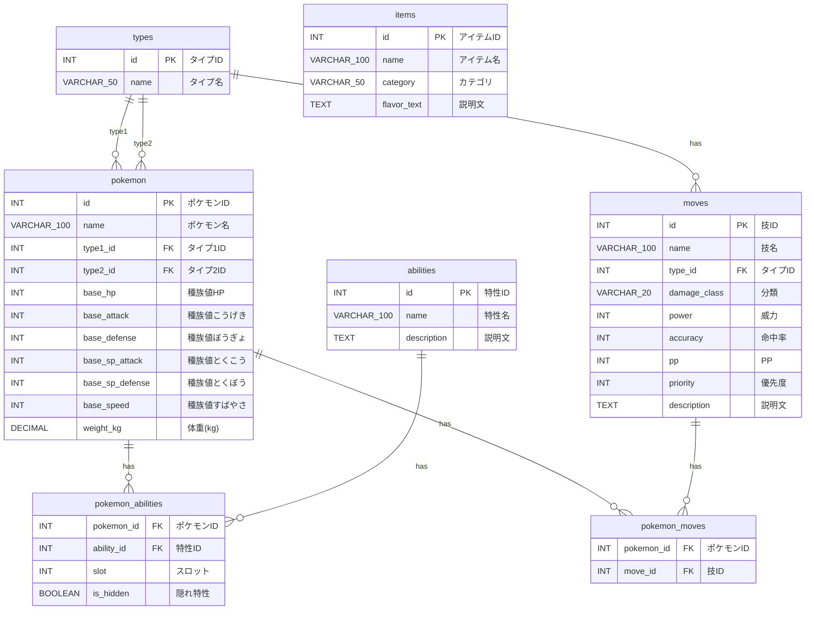

```mermaid
erDiagram
    types {
        INT id PK "タイプID"
        VARCHAR_50 name "タイプ名"
    }

    pokemon {
        INT id PK "ポケモンID"
        VARCHAR_100 name "ポケモン名"
        INT type1_id FK "タイプ1ID"
        INT type2_id FK "タイプ2ID"
        INT base_hp "種族値HP"
        INT base_attack "種族値こうげき"
        INT base_defense "種族値ぼうぎょ"
        INT base_sp_attack "種族値とくこう"
        INT base_sp_defense "種族値とくぼう"
        INT base_speed "種族値すばやさ"
        DECIMAL weight_kg "体重(kg)"
    }

    abilities {
        INT id PK "特性ID"
        VARCHAR_100 name "特性名"
        TEXT description "説明文"
    }

    pokemon_abilities {
        INT pokemon_id FK "ポケモンID"
        INT ability_id FK "特性ID"
        INT slot "スロット"
        BOOLEAN is_hidden "隠れ特性"
    }

    moves {
        INT id PK "技ID"
        VARCHAR_100 name "技名"
        INT type_id FK "タイプID"
        VARCHAR_20 damage_class "分類"
        INT power "威力"
        INT accuracy "命中率"
        INT pp "PP"
        INT priority "優先度"
        TEXT description "説明文"
    }

    pokemon_moves {
        INT pokemon_id FK "ポケモンID"
        INT move_id FK "技ID"
    }

    items {
        INT id PK "アイテムID"
        VARCHAR_100 name "アイテム名"
        VARCHAR_50 category "カテゴリ"
        TEXT flavor_text "説明文"
    }

    types ||--o{ pokemon : "type1"
    types ||--o{ pokemon : "type2"
    types ||--o{ moves : "has"
    pokemon ||--o{ pokemon_abilities : "has"
    abilities ||--o{ pokemon_abilities : "has"
    pokemon ||--o{ pokemon_moves : "has"
    moves ||--o{ pokemon_moves : "has"

```
