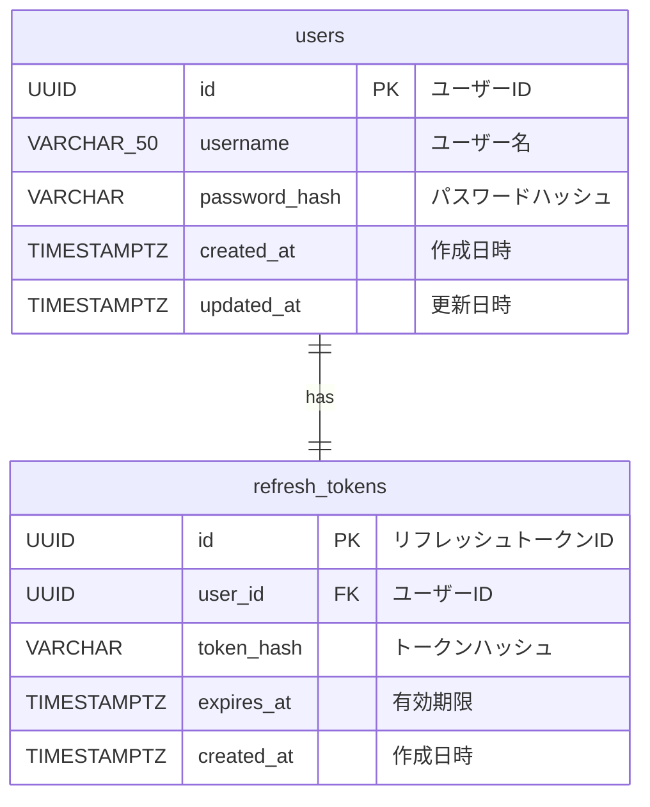

```mermaid
erDiagram
    users {
        UUID id PK "ユーザーID"
        VARCHAR_50 username "ユーザー名"
        VARCHAR password_hash "パスワードハッシュ"
        TIMESTAMPTZ created_at "作成日時"
        TIMESTAMPTZ updated_at "更新日時"
    }

    refresh_tokens {
        UUID id PK "リフレッシュトークンID"
        UUID user_id FK "ユーザーID"
        VARCHAR token_hash "トークンハッシュ"
        TIMESTAMPTZ expires_at "有効期限"
        TIMESTAMPTZ created_at "作成日時"
    }

    users ||--|| refresh_tokens : "has"

```