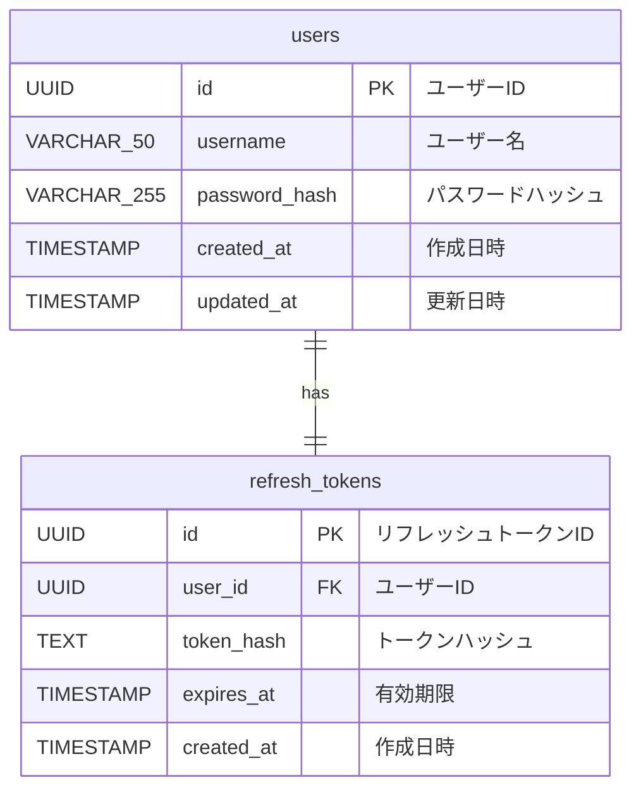

```mermaid
erDiagram
    users {
        UUID id PK "ユーザーID"
        VARCHAR_50 username "ユーザー名"
        VARCHAR_255 password_hash "パスワードハッシュ"
        TIMESTAMP created_at "作成日時"
        TIMESTAMP updated_at "更新日時"
    }

    refresh_tokens {
        UUID id PK "リフレッシュトークンID"
        UUID user_id FK "ユーザーID"
        TEXT token_hash "トークンハッシュ"
        TIMESTAMP expires_at "有効期限"
        TIMESTAMP created_at "作成日時"
    }

    users ||--|| refresh_tokens : "has"

```
